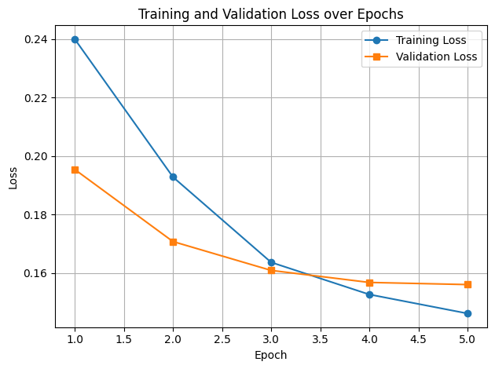

# Dhivehi to Latin Transliteration

> **⚠️ Work in Progress**: This project is currently under active development.

## TODO

- [ ] Add dataset to Hugging Face Hub
- [ ] Separate training and inference scripts
- [ ] Fine-tune FLAN-T5 small model using distillation
- [ ] Retrain using larger dataset (100k samples)
- [ ] Train model in reverse (latin to dhivehi)

## Overview

This project provides a fine-tuned FLAN-T5 model for transliterating Dhivehi text from Thaana script to Latin script. The model was trained on 20,000 Thaana-Latin transliteration pairs scraped from [Mihaaru News](https://mihaaru.com). The base model we used can be found here: [alakxender/flan-t5-base-dhivehi-en-latin](https://huggingface.co/alakxender/flan-t5-base-dhivehi-en-latin).

## Quick Start

### Installation

```bash
pip install transformers torch
```

### Usage

```python
from transformers import (
    AutoTokenizer,
    T5ForConditionalGeneration
)

MODEL_CHECKPOINT = "politecat314/flan-t5-base-dv2latin-mihaaru"

# Load the fine-tuned model and tokenizer
fine_tuned_tokenizer = AutoTokenizer.from_pretrained(MODEL_CHECKPOINT)
fine_tuned_model = T5ForConditionalGeneration.from_pretrained(MODEL_CHECKPOINT)

# Example text
source_text = "އިންޑިއާގައި ފޭކް އެމްބަސީއެއް ހަދައިގެން އުޅުނު މީހަކު ހައްޔަރުކޮށްފި"
prompt = f"dv2latin: {source_text.strip()}"

# Generate translation
inputs = fine_tuned_tokenizer(prompt, return_tensors="pt")
output_ids = fine_tuned_model.generate(**inputs, max_length=128)
result = fine_tuned_tokenizer.decode(output_ids[0], skip_special_tokens=True)

print(f"\nSource (Dhivehi): {source_text}")
print(f"Result (Latin): {result}")
```

**Output:**
```
Source (Dhivehi): އިންޑިއާގައި ފޭކް އެމްބަސީއެއް ހަދައިގެން އުޅުނު މީހަކު ހައްޔަރުކޮށްފި
Result (Latin): India gai fake embassy eh hadhaigen ulhunu meehaku hayyaru koffi
```

## Examples

### Successful Transliterations

**Example 1:**
```
Input:  މޯލްޑިވިއަންގެ ބޯޓުތަކުގައި ތާނައިން ރާއްޖޭގެ ނަން ލިޔެފި
Output: Maldivian ge boat thakugai Thaanain Raajjeyge nan liyefi
```

**Example 2:**
```
Input:  ޗައިނާގެ ގްރޫޕަކުން ސިންގަޕޫރަށް ވަރުގަދަ ސައިބާ ހަމަލާތަކެއް ދީފި
Output: China ge group eh Singapore ah varugadha saba hamalaathakeh dheefi
```

### Known Limitations

The model may occasionally miss or skip certain words during transliteration:

```
Input:  މެލޭޝިޔާގައި ބޮޑުވަޒީރުގެ އިސްތިއުފާއަށް ގޮވާ، ސަރުކާރާ ދެކޮޅަށް މުޒާހަރާ ކުރަނީ
Output: sarukaaraa dhekolhah muzaaharaa kuranee
```
*Note: Some words are missing from this transliteration.*

## Dataset

The training dataset consists of 20K Thaana-Latin transliteration pairs scraped from [Mihaaru News](https://mihaaru.com). The dataset captures contemporary Dhivehi usage in news media.

## Files Structure

```
dhivehi-transliteration/
├── README.md
├── requirements.txt
├── inference.py
├── data/
│   └── train.csv
|───└── test.csv
├── scripts/
│   ├── train.ipynb
│   ├── data_cleaning.ipynb
```

## Training

To fine-tune the model on your own dataset:

1. Format your data like `data/train.csv` with columns: `latin` and `Dhivehi`.
2. Use GPU for faster training. Install PyTorch: [pytorch.org/get-started/locally](https://pytorch.org/get-started/locally/)
3. Install dependencies:
   ```bash
   pip install -r requirements.txt
   ```
4. Run the training notebook `scripts/train.ipynb`

The current model was trained for 5 epochs with a final validation loss of 0.155982.


## Contributing

Contributions are welcome! Please feel free to submit issues, feature requests, or pull requests.

## License

This project is released under the MIT License. See [LICENSE](LICENSE) for details.

## Resources

- **🤗 Hugging Face Model**: [politecat314/flan-t5-base-dv2latin-mihaaru](https://huggingface.co/politecat314/flan-t5-base-dv2latin-mihaaru)
- **Base Model**: [alakxender/flan-t5-base-dhivehi-en-latin](https://huggingface.co/alakxender/flan-t5-base-dhivehi-en-latin)
- **Data Source**: [Mihaaru News](https://mihaaru.com)


## Special Thanks

Special thanks to everyone who scraped, cleaned, and labeled the data. Your efforts laid the essential foundation for this project and made it possible.

- [Maadh](https://github.com/itsMaadh)
- [Nazanbe]()
- [Shubbe]()
- [Yaaniu]()
- [Naif]()